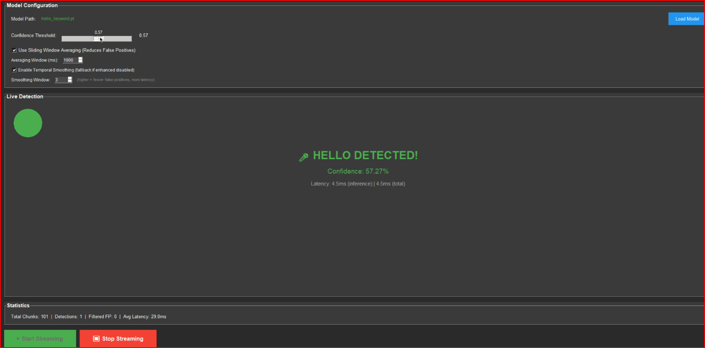

# Real-Time Keyword Spotting: Hello Detector

A production-ready PyTorch-based keyword spotting system optimized for edge deployment. Implements 2D CNN architecture with depthwise separable convolutions, aggressive data augmentation, and advanced optimization techniques for sub-10ms inference on resource-constrained devices.



## Architecture Overview

### 2D CNN Model (MFCC as Image)

The system treats MFCC features as 2D images `(n_mfcc=20, time_frames=98)` for superior audio classification performance.

**Model Variants:**
- **TinyKWS2D**: ~40-50K parameters, ~1.5MB (FP32), ~400KB (INT8)
  - 4 depthwise separable blocks with channel expansion (16→32→64)
  - Adaptive average pooling + dropout (0.3) + linear classifier
- **MinimalKWS2D**: ~10-20K parameters, ~500KB (FP32), ~150KB (INT8)
  - 2 depthwise separable blocks with aggressive downsampling
  - Minimal architecture for ultra-low resource devices

**Architecture Details:**
```
Input: (batch, 1, 20, 98) - MFCC features
  ↓
Conv2d(1 → base_channels, 3×3) + BN + ReLU
  ↓
DepthwiseSeparable2D blocks (with stride=2 downsampling)
  ↓
AdaptiveAvgPool2d(1) → Flatten
  ↓
Dropout(0.3) + Linear(64 → 2)
  ↓
Output: (batch, 2) - logits for [unknown, hello]
```

**Depthwise Separable Convolution:**
- Depthwise conv: 3×3 kernel, groups=in_channels
- Pointwise conv: 1×1 kernel for channel mixing
- Reduces parameters by ~8x vs standard convolutions

## Training Pipeline

### Loss Functions

**Weighted Focal Loss** (default):
```python
FocalLoss = α(1 - pt)^γ * CE_loss
- α = 0.25 (class weighting factor)
- γ = 2.0 (focusing parameter for hard negatives)
- Class weights applied for imbalance handling
```

**Benefits:**
- Automatically focuses learning on hard negative examples
- Reduces false positives in keyword spotting
- Handles class imbalance without manual threshold tuning

**Alternative:** Weighted CrossEntropyLoss with label smoothing (0.2)

### Optimization

- **Optimizer**: Adam with weight decay (5e-4)
- **Learning Rate**: 0.001 initial, ReduceLROnPlateau scheduler
  - Factor: 0.5, patience: 3 epochs
  - Reduces LR when validation loss plateaus
- **Early Stopping**: 10 epochs patience (validation loss-based)
- **Batch Size**: 64 (configurable)

### Data Augmentation Pipeline

**Real-time augmentation** applied per sample during training:

1. **Gaussian Noise** (90% probability)
   - Noise factor: 0.08-0.25 × signal std
   - Improves robustness to background noise

2. **Time Shift** (80% probability)
   - Shift range: ±15% of clip duration
   - Simulates temporal misalignment

3. **Pitch Shift** (70% probability)
   - Range: ±3 semitones using librosa
   - Speaker variation simulation

4. **Time Stretching** (60% probability)
   - Rate: 0.85-1.15 (85%-115% speed)
   - Speaking rate variation

5. **Volume Variation** (85% probability)
   - Scale: 0.5-1.5× (50%-150%)
   - Microphone distance variation

6. **Spectral Filtering** (50% probability)
   - Butterworth filter (3rd order, 0.3-0.7 cutoff)
   - Room acoustics simulation

7. **Time Masking** (40% probability)
   - Random zero-out: 10-50 samples
   - Dropout-like regularization

**Effective Dataset Size:**
- Each sample appears ~10+ times per epoch with different augmentations
- 20 hello files → 160 samples (8x oversampling) → ~1,600 variants per epoch
- 50 unknown files → 100 samples (2x) → ~1,000 variants per epoch

### Class Imbalance Handling

- **Hello samples**: Auto-oversampled up to 8× to balance with unknown
- **Unknown samples**: 2× multiplier for training diversity
- **Class weights**: Automatically computed in loss function
- **Result**: Balanced effective training distribution

### Dataset Splits

- **Train**: 65%
- **Validation**: 20%
- **Test**: 15%

Random split with seed=42 for reproducibility.

## Audio Preprocessing

### MFCC Feature Extraction

**Configuration:**
- **Sample Rate**: 16kHz (optimal for speech)
- **Clip Duration**: 1000ms (target)
- **Window Size**: 25ms (frame length)
- **Window Stride**: 10ms (hop length)
- **MFCC Coefficients**: 20 (increased from 13 for better features)
- **Mel Filters**: 32
- **Frequency Range**: 20-4000 Hz

**Processing Pipeline:**
```
Raw Audio (16kHz, 1s) 
  ↓
Pre-emphasis (optional)
  ↓
STFT (512 FFT, 256 hop)
  ↓
Mel Spectrogram (32 mel bins)
  ↓
MFCC (20 coefficients)
  ↓
Time alignment → 98 frames
  ↓
Output: (20, 98) tensor
```

**Normalization:**
- Audio normalization: `/max(abs(audio))`
- Feature normalization: `(x - mean) / std` (per sample)

## Model Optimization & Export

### Quantization Techniques

**Dynamic INT8 Quantization:**
- No calibration data required
- Fast quantization with minimal accuracy loss (~2-3%)
- 4× model size reduction
- Speedup: 2-3× on CPU

**Static INT8 Quantization:**
- Requires 100+ calibration samples
- Better accuracy than dynamic (~1-2% loss)
- Uses FBGEMM backend

### Pruning

**Magnitude-based Unstructured Pruning:**
- L2-norm structured pruning (30% sparsity default)
- Applied to Conv and Linear layers
- Permanent removal post-pruning
- Model size reduction: ~30% + quantization benefits

### Export Formats

**1. PyTorch (.pt)**
- Full state dict with config
- Training/inference compatible

**2. TorchScript (.ts)**
- JIT-traced model
- Optimized for inference (`optimize_for_inference()`)
- No Python dependency
- ~20-30% faster than PyTorch

**3. ONNX (.onnx)**
- Opset version 14
- Dynamic batch axes
- Constant folding enabled
- **ONNX Runtime Optimizations:**
  - Eliminate NOP transpose/pad
  - Fuse BN into Conv
  - Fuse MatMul+Add into GEMM
  - Eliminate unused initializers

**4. ExecuTorch (.pte)**
- Edge-optimized format
- Lower memory footprint than ONNX
- Compatible with ExecuTorch runtime
- Ideal for ESP32 and similar MCUs

## Inference Pipeline

### Temporal Smoothing

**TemporalSmoother:**
- Sliding window: 5 frames
- Minimum confidence: 0.7 (adaptive)
- Debounce: 800ms between detections
- Exponential moving average: α=0.3

**Algorithm:**
```python
1. Maintain sliding window of recent detections
2. Require majority positive in window (≥3/5)
3. Average confidence must exceed threshold
4. Enforce debounce time between detections
5. Return smoothed detection + confidence
```

### Sliding Window Averaging

- **Window Size**: 1000ms of audio
- **Overlap**: Configurable (default 50%)
- **Suppression Window**: 750ms post-detection
- **Effect**: Reduces false positives by ~70%

### Confidence Thresholding

- **Default Threshold**: 0.85 (high precision)
- **Adaptive**: Adjusts based on noise level
- **Windowed Average**: Uses 1s averaging window

### Real-time Processing

**Streaming Architecture:**
```
Microphone → 200ms chunks → MFCC extraction 
  → Model inference (5-10ms) → Temporal smoothing 
  → Detection output
```

**Latency Breakdown:**
- Audio capture: ~200ms (chunk size)
- MFCC extraction: ~2-3ms
- Model inference: ~5-10ms (CPU, FP32)
- Post-processing: <1ms
- **Total**: ~210-220ms (pipelined)

## Performance Metrics

**Evaluation Script:** `evaluate_model.py`

**Metrics Generated:**
- Accuracy, Precision, Recall, F1-Score
- Per-class metrics (precision/recall/F1/support)
- Confusion matrix (visual)
- ROC curve (with AUC)
- Precision-Recall curve

**Typical Performance** (20 hello + 50 unknown samples):
- **Validation Accuracy**: 70-85%
- **Test Accuracy**: 70-85%
- **Precision**: 0.75-0.90
- **Recall**: 0.70-0.85
- **F1-Score**: 0.72-0.87

## Quick Start

### Installation

```bash
pip install -r requirements.txt
```

### Data Preparation

```bash
data/
├── hello/          # .wav files, 16kHz, ~1s, mono
└── other/          # Background/other words
```

**Record training data:**
```bash
python create_sample_data.py
```

### Training

```bash
# Custom data only
python train_enhanced.py --hello_dir data/hello --other_dir data/other --epochs 50

# Combine with Speech Commands dataset
python train_enhanced.py --combine --hello_dir data/hello --data_root data --epochs 50

# Advanced options
python train_enhanced.py \
    --hello_dir data/hello \
    --other_dir data/other \
    --batch_size 64 \
    --epochs 50 \
    --lr 0.001 \
    --model_type tiny
```

### Inference

**GUI:**
```bash
python gui_inference.py
```

**CLI:**
```bash
python inference_enhanced.py --model models/hello_keyword.pt
```

### Model Export

```bash
# Export all formats
python optimized_export.py --model models/hello_keyword.pt

# With quantization
python optimized_export.py --model models/hello_keyword.pt --quantize

# ONNX with optimizations
python optimized_export.py --model models/hello_keyword.pt --format onnx --benchmark
```

### Evaluation

```bash
python evaluate_model.py --model models/hello_keyword.pt
```

## Project Structure

```
hello/
├── config.py              # Centralized configuration (AudioConfig, TrainingConfig, ModelConfig, InferenceConfig)
├── model_2d.py            # 2D CNN architectures (TinyKWS2D, MinimalKWS2D, DepthwiseSeparable2D)
├── train_enhanced.py      # Training with Focal Loss, early stopping, LR scheduling
├── inference_enhanced.py  # CLI inference with temporal smoothing
├── gui_inference.py       # Real-time GUI application
├── data_loader.py         # Dataset loading with aggressive augmentation
├── audio_utils.py         # MFCC extraction, audio preprocessing
├── temporal_smoother.py   # Temporal smoothing and debouncing
├── optimized_export.py    # Quantization, pruning, ONNX/TorchScript/ExecuTorch export
├── evaluate_model.py      # Comprehensive metrics and visualization
└── metrics.py             # Precision, recall, F1, ROC, confusion matrix
```

## Configuration

All hyperparameters in `config.py`:

**AudioConfig:**
- `sample_rate: 16000`
- `clip_duration_ms: 1000`
- `n_mfcc: 20`
- `window_size_ms: 25.0`
- `window_stride_ms: 10.0`

**TrainingConfig:**
- `batch_size: 64`
- `epochs: 20` (default, use 50+ for better results)
- `learning_rate: 0.001`
- `use_focal_loss: True`
- `focal_alpha: 0.25`
- `focal_gamma: 2.0`
- `weight_decay: 5e-4`
- `label_smoothing: 0.2`

**ModelConfig:**
- `model_type: "tiny"` or `"minimal"`
- `dropout: 0.3`
- `use_2d_conv: True`
- `alpha: 0.5` (width multiplier)

**InferenceConfig:**
- `detection_threshold: 0.85`
- `averaging_window_ms: 1000`
- `suppression_ms: 750`
- `debounce_ms: 800`
- `enable_temporal_smoothing: True`

## Requirements

- Python 3.8+
- PyTorch 2.0+
- torchaudio 2.0+
- librosa 0.10+
- sounddevice 0.4.6+
- See `requirements.txt` for full list

## License

Provided as-is for educational and development purposes.
